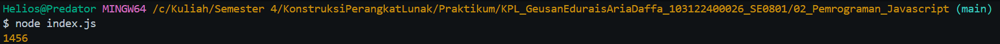

# Tugas Pendahuluan 02: Pemrograman JavaScript

**Output**

**Deskripsi Program**

Program ini menjalankan perkalian semua bilangan positif dalam larik (array). Ini akan bekerja untuk bilangan positif, nol, dan negatif.