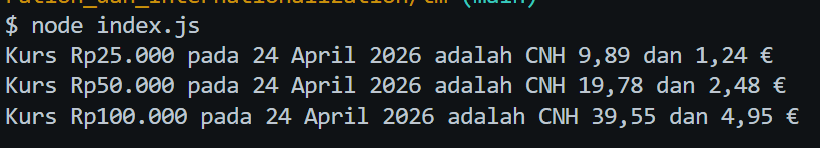

# Tugas Mandiri: Runtime Configuration dan Internationalization

**Nama:** Geusan Edurais Aria Daffa  
**NIM:** 103122400026  
**Kelas:** SE-08-01

## Program/Kode

Tersedia di [index.js](./index.js)

## Output

## 📝 Jawaban Tugas Mandiri

### Implementasi Runtime Configuration (.env)
Untuk menjaga keamanan data sensitif seperti URL API, saya menggunakan variabel lingkungan (*environment variables*).
1. **Pemisahan Konfigurasi:** URL API disimpan di dalam file `.env` dengan kunci `BASE_API`.
2. **Keamanan:** Dengan cara ini, kredensial atau endpoint sensitif tidak tertulis langsung (*hardcoded*) di dalam kode utama, sehingga lebih aman saat diunggah ke repositori.
3. **Pembersihan Log:** Menggunakan konfigurasi `quiet` pada *dotenv* untuk memastikan terminal bersih dari pesan promosi, sehingga fokus hanya pada output program.

### Internationalization (Intl.NumberFormat & Intl.DateTimeFormat)
Dalam menampilkan kurs Rupiah (IDR) terhadap Renminbi (CNH) dan Euro (EUR), saya menggunakan objek `Intl` untuk memastikan format yang dihasilkan sesuai dengan standar lokal (Indonesia).
1. **Lokalisasi Mata Ung:** Menggunakan `Intl.NumberFormat` dengan locale `id-ID` untuk menghasilkan pemisah ribuan titik (`.`) pada Rupiah dan pemisah desimal koma (`,`) pada kurs asing, sesuai dengan instruksi tugas.
2. **Format Tanggal:** Menggunakan `Intl.DateTimeFormat` agar tanggal yang diambil dari API otomatis terkonversi menjadi format bahasa Indonesia (Contoh: "24 April 2026") tanpa perlu pemetaan bulan secara manual.

### Analisis Runtime
Dalam konteks *Runtime Configuration*, penggunaan `process.env` memungkinkan aplikasi untuk menyesuaikan perilakunya berdasarkan lingkungan tempat ia berjalan tanpa mengubah kode sumber. Digabungkan dengan `Intl`, program ini menunjukkan bagaimana data mentah dari API diproses melalui *formatter* di sisi runtime untuk menyajikan informasi yang relevan dan mudah dipahami oleh pengguna di wilayah tertentu (internasionalisasi).