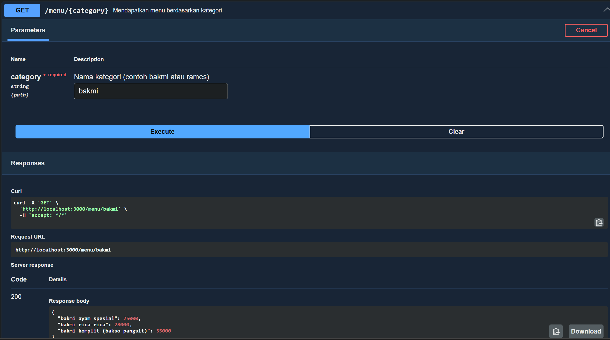
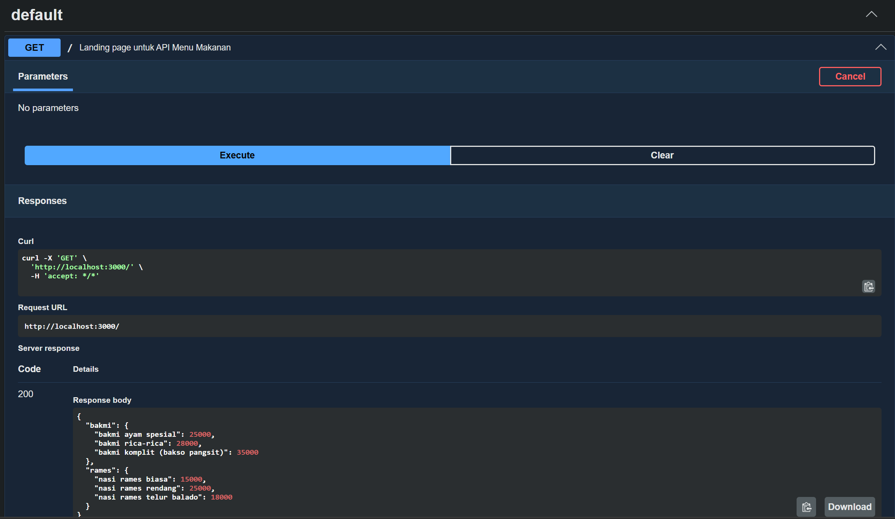

# Tugas Pendahuluan: API Design dan Construction Using Swagger

**Nama:** Geusan Edurais Aria Daffa  
**NIM:** 103122400026  
**Kelas:** SE-08-01

## Program/Kode

Tersedia di [index.js](./index.js)

## Output

## 📝 Jawaban Tugas Pendahuluan

Pada Tugas Pendahuluan kali ini, fokus utamanya adalah memahami dan mengimplementasikan pola desain (Design Pattern) untuk menciptakan struktur kode yang lebih modular, terukur, dan mudah dikelola.

### Implementasi Singleton Pattern & Routing
Dalam kode yang dibuat, saya menerapkan konsep dasar dari pola desain untuk mengelola data menu makanan secara terpusat. Hal ini memastikan:
1. **Struktur Data Terorganisir:** Data dipisahkan berdasarkan kategori (Creational Logic) sehingga pengambilan data melalui API menjadi lebih efisien.
2. **Endpoint Dinamis:** Menggunakan *Path Parameter* (`:category`) pada Express.js yang memungkinkan server memberikan respon spesifik berdasarkan input pengguna, mencerminkan prinsip fleksibilitas dalam desain perangkat lunak.

### Dokumentasi API dengan Swagger (OpenAPI)
Sebagai bagian dari praktik desain yang baik, modul ini menekankan pada penyediaan dokumentasi yang terstandarisasi. Penggunaan Swagger memungkinkan:
* **Interface Visual:** Memudahkan developer lain untuk memahami skema request dan response tanpa harus membaca seluruh baris kode.
* **Testing Mandiri:** Fitur *Try it out* pada Swagger UI memvalidasi apakah logika routing dan penanganan parameter sudah sesuai dengan rancangan.

### Analisis Design Pattern
Dalam konteks pengembangan aplikasi berbasis Web API, penerapan pola seperti **Structural Patterns** (melalui penggunaan Middleware di Express) dan **Creational Patterns** (pengelolaan objek menu) membantu meminimalkan redundansi. Kode yang dirancang memastikan bahwa penambahan kategori menu baru di masa depan tidak akan merusak logika pengambilan data yang sudah ada (Open/Closed Principle), yang merupakan inti dari penggunaan Design Pattern.