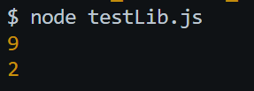

# Tugas Pendahuluan: Library Construction

**Nama:** Geusan Edurais Aria Daffa  
**NIM:** 103122400026  
**Kelas:** SE-08-01

## Program/Kode

Tersedia di [index.js](./index.js)

## Output

## 📝 Jawaban Tugas Pendahuluan

Pada Tugas Pendahuluan kali ini, fokus utamanya adalah membangun sebuah pustaka (*library*) sederhana menggunakan JavaScript modern (ESM) untuk melakukan pemrosesan teks.

### Implementasi Library Construction
Dalam pembuatan pustaka ini, saya menerapkan prinsip modularitas dengan memisahkan fungsi utilitas ke dalam berkas tersendiri. Fungsi yang dikembangkan meliputi:
1.  **`hitungHuruf`**: Menggunakan *Regular Expression* (`/[a-zA-Z]/g`) untuk mengidentifikasi dan menghitung karakter alfabet saja (A-Z), sesuai kriteria yang mengabaikan angka, simbol, maupun spasi.
2.  **`hitungKata`**: Menggunakan metode `trim()` dan `split()` dengan regex spasi (`/\\s+/`) untuk membagi string menjadi array kata, memastikan perhitungan jumlah kata tetap akurat meskipun terdapat spasi berlebih atau karakter baris baru.

### Pola Ekspor Impor (ES Modules)
Sesuai dengan materi Modul 10, pustaka ini menggunakan standar **ESM (ECMAScript Modules)** yang diperkenalkan sejak ES2015. 
* **Export**: Menggunakan kata kunci `export` pada tiap fungsi agar bisa digunakan oleh perangkat lunak lain sebagai solusi modular.
* **Import**: Menggunakan kata kunci `import` dengan path yang eksplisit (menyertakan ekstensi `.js`) untuk mematuhi standar Node.js terbaru dalam menangani modul agar tidak terjadi error *unsupported directory import*.

### Analisis Struktur Pustaka
Dalam konteks *Library Construction*, penggunaan berkas `package.json` dengan konfigurasi `"type": "module"` menjadi krusial. Konfigurasi ini memberitahu *runtime* Node.js untuk memperlakukan semua berkas `.js` dalam folder tersebut sebagai ES Modules. Pembuatan pustaka ini memungkinkan pemisahan direktori antara kode pustaka dan aplikasi utama, yang mempermudah pemeliharaan dan pengujian kode secara terisolasi.